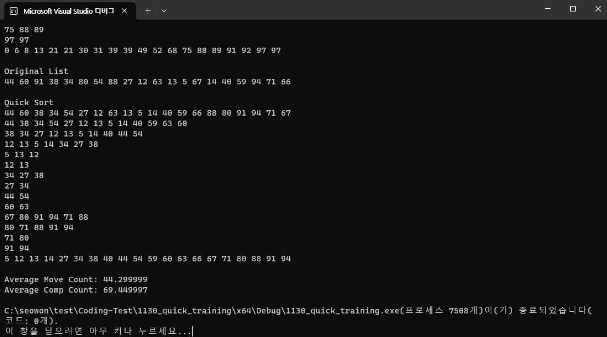

선택, 삽입, 버블 정렬은 O(n^2)의 평균 비교 횟수를 가진다. 평균 이동 횟수도 O(n^2)이다. 이 정렬들은 큰 데이터셋에서는 비효율적이다.
셸 정렬은 간격에 따라 평균 비교 횟수가 달라지며, 합병 정렬과 퀵 정렬에 비해 성능이 상대적으로 떨어질 수 있다.
합병 정렬과 퀵 정렬은 O(nlog n)의 평균 비교 횟수를 가지며, 특히 합병 정렬은 이동 횟수도 O(nlog n)으로 효율적이다.

정렬 알고리즘의 선택은 사용하는 데이터와 상황에 따라서 달라진다.
합병 정렬과 퀵 정렬은 일반적으로 빠른 성능을 제공하며, 선택, 삽입, 버블 정렬은 간단하다는 장점이 있지만 대규모 데이터에는 적합하지 않을 수 있다.
# Quick

